# isomage

Browse and extract files from ISO images without mounting them.

No root. No FUSE. No mount points. Just read the bytes.

<p align="center">
  
</p>

## Install

**Homebrew** (macOS and Linux):

```sh
brew install jackdanger/tap/isomage
```

**Cargo** (any platform with Rust):

```sh
cargo install isomage
```

**Binary** — grab a prebuilt binary from [releases](../../releases):

```sh
# macOS (Apple Silicon)
curl -L https://github.com/JackDanger/isomage/releases/latest/download/isomage-macos-arm64.tar.gz | tar xz
sudo mv isomage-macos-arm64 /usr/local/bin/isomage

# Linux (x86_64, static musl)
curl -L https://github.com/JackDanger/isomage/releases/latest/download/isomage-linux-x86_64.tar.gz | tar xz
sudo mv isomage-linux-x86_64 /usr/local/bin/isomage
```

**From source**:

```sh
git clone https://github.com/JackDanger/isomage.git
cd isomage && cargo build --release
```

## Usage

### List contents

```sh
isomage movie.iso
```
```
d / (24.8 GB)
  d BDMV (24.8 GB)
    d STREAM (24.7 GB)
      - 00000.m2ts (20.1 GB)
      - 00001.m2ts (4.6 GB)
    d CLIPINF (1.2 KB)
    d PLAYLIST (408 B)
  - CERTIFICATE (3.1 KB)
```

### Cat a file to stdout

Print any file straight to stdout — no extraction, no temp files. Pipe it wherever you want:

```sh
# Inspect a file
isomage -c etc/hostname linux.iso

# Pipe to other tools
isomage -c BDMV/PLAYLIST/00000.mpls movie.iso | hexdump -C

# Page through a file
isomage -c readme.txt data.iso | less

# Play video directly from the ISO
isomage -c BDMV/STREAM/00000.m2ts movie.iso | mpv -
```

### Extract files

Extract a single file, a directory tree, or the whole disc:

```sh
# One file
isomage -x BDMV/STREAM/00001.m2ts movie.iso

# A directory (recursively)
isomage -x BDMV/STREAM -o ./streams movie.iso

# Everything
isomage -x / -o ./full_dump movie.iso
```

### Verbose / debug mode

See how the filesystem is being parsed — useful when a disc won't read:

```sh
isomage -v movie.iso
```
```
File size: 26663725056 bytes (24.84 GB)
Scanning key sectors for filesystem signatures...
  Sector  16 (ISO 9660 PVD / UDF VRS): 01 43 44 30 30 31 01 00  |.CD001..|
  Sector 256 (UDF AVDP): 02 00 02 00 ...
Attempting ISO 9660 parsing...
  Found Primary Volume Descriptor at sector 16
  ...
```

## Supported formats

- **ISO 9660** with Joliet (Unicode filenames) and Rock Ridge (POSIX long filenames) extensions
- **UDF** including metadata partitions and multi-extent files

Covers CDs, DVDs, and Blu-rays.

## Why

I got tired of leaving a container just to `mount` an image just to read one file. `isomage` runs entirely in userspace — it reads the raw bytes and reconstructs the filesystem tree itself.

## Cross-compile

```sh
make install-targets   # one-time: adds musl target
make build-linux       # static linux binary from macOS
```

## Limitations

- Read-only (by design)
- Some exotic UDF variations might not parse correctly

If you hit a disc that doesn't work, run with `-v` and open an issue.

## License

[MIT](LICENSE)
